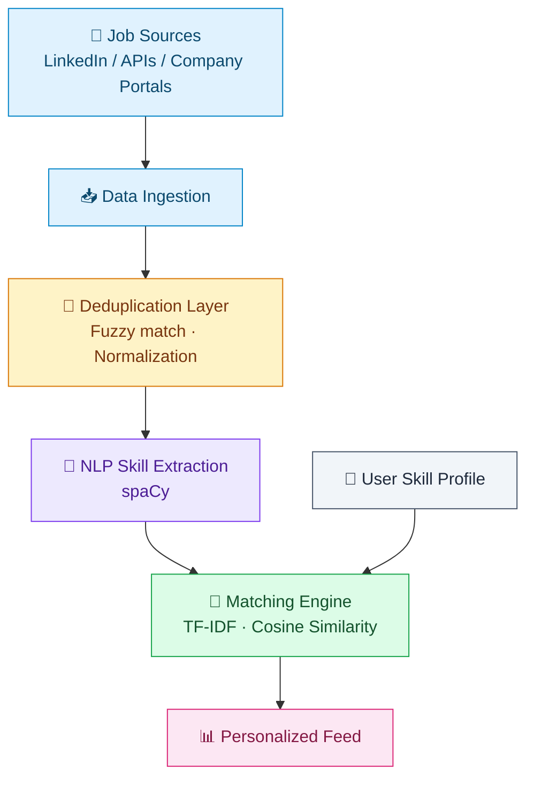
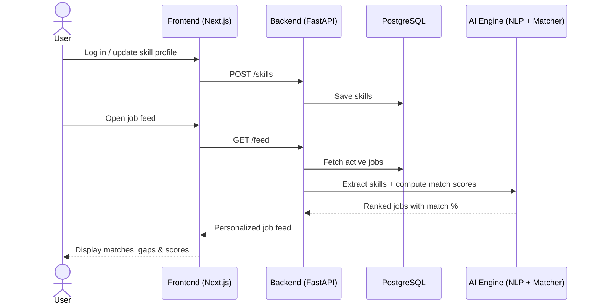
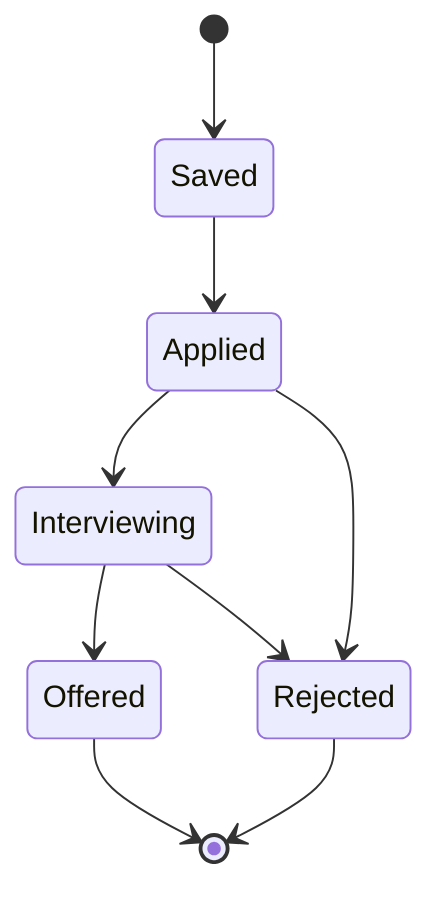
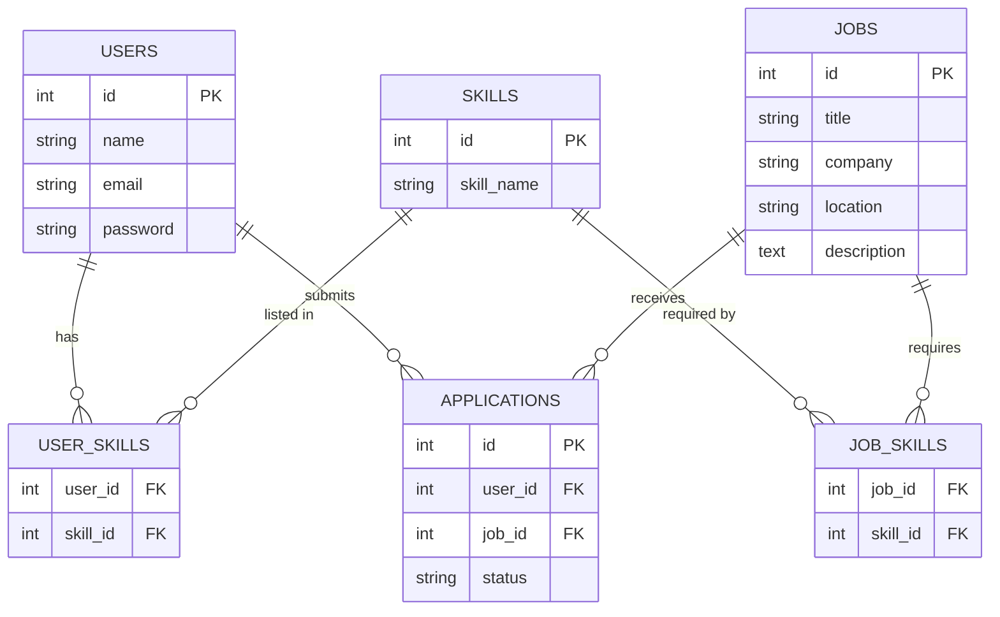

<div align="center">

# 🚀 Skill-Centric Unified Job Search Aggregator

**An AI-powered job aggregation and recommendation platform that matches people to jobs based on what they can actually do — not just keywords.**


</div>

> 💡 Diagrams in this README are written in [Mermaid](https://mermaid.js.org/) and render automatically on GitHub, GitLab, and most modern Markdown viewers (including VS Code with the Mermaid extension).

---

## 📖 Table of Contents

- [Overview](#-project-overview)
- [Problem Statement](#-problem-statement)
- [System Architecture](#️-system-architecture)
- [Key Features](#-key-features)
- [Tech Stack](#️-tech-stack)
- [Project Structure](#-project-structure)
- [Database Schema](#️-database-schema)
- [Getting Started](#-getting-started)
- [API Endpoints](#-api-endpoints)
- [Team](#-team-members)
- [Roadmap](#-future-enhancements)
- [License](#-license)

---

## 📌 Project Overview

Traditional job portals rely heavily on keyword-based searches, which often surface irrelevant results and bury the roles that actually fit a candidate. This project introduces a **Skill-Centric Approach**: jobs are recommended based on a user's real skill profile rather than simple string matching.

The platform:

- 🔄 Aggregates jobs from multiple sources
- 🧹 Removes duplicate job postings
- 🧠 Extracts required skills from job descriptions using NLP
- 🎯 Matches user skills against job requirements
- 📊 Delivers personalized job recommendations
- 📌 Tracks saved and applied jobs end-to-end

## 🎯 Problem Statement

Job seekers consistently run into:

| Pain Point | Impact |
|---|---|
| Irrelevant search results | Wasted time sifting through unrelated postings |
| Duplicate job postings | Same role listed 5+ times across sources |
| Difficulty identifying suitable opportunities | Good-fit roles get lost in the noise |
| Lack of personalization | Everyone sees the same generic results |

This system addresses each of these with **Natural Language Processing (NLP)** and **skill-based matching algorithms**.

## 🏗️ System Architecture



Each stage is decoupled, so sources, dedup logic, or the matching algorithm can evolve independently without breaking the pipeline.

### 🔁 Request-Level Flow



## ✨ Key Features

### 🔐 Authentication System
- User registration & login
- JWT-based authentication
- Protected routes for authenticated actions

### 👤 Skill Profile Management
Users can add, remove, and update skills to maintain a living profile:

```
Python · React · Docker · SQL · AWS
```

### 📥 Job Aggregation
Collects postings from APIs, company career pages, and job boards, storing everything in a centralized database.

### 🔄 Deduplication Engine
Detects and removes duplicate listings using:
- Fuzzy matching
- Title normalization
- Company normalization
- Location standardization

### 🧠 NLP Skill Extraction
Automatically pulls required skills out of raw job description text.

**Input:**
> "Looking for a Python Developer with Docker and AWS experience."

**Output:**
```json
["Python", "Docker", "AWS"]
```

### 🎯 Recommendation Engine
Built on **TF-IDF vectorization** and **cosine similarity**.

| User Skills | Job Skills | Match Score |
|---|---|---|
| Python, SQL, React | Python, SQL, Docker | **85%** |

### 📊 Personalized Job Feed
Every recommended job shows:
- Match percentage
- Matching skills
- Missing skills (skill gaps to close)

### 📌 Application Tracker
Tracks each job through its lifecycle:



## 🛠️ Tech Stack

| Layer | Technologies |
|---|---|
| **Frontend** | React.js, Next.js, Tailwind CSS |
| **Backend** | FastAPI, Python |
| **Database** | PostgreSQL |
| **NLP & AI** | spaCy, Scikit-Learn, TF-IDF, Cosine Similarity |
| **DevOps** | Docker, Docker Compose |
| **Authentication** | JWT, Passlib |

## 📂 Project Structure

```
skill-centric-job-search/
│
├── frontend/
│   ├── pages/
│   ├── components/
│   ├── services/
│   └── styles/
│
├── backend/
│   ├── routes/
│   ├── models/
│   ├── database/
│   ├── auth/
│   └── main.py
│
├── ai_engine/
│   ├── skill_extractor.py
│   ├── matcher.py
│   ├── jobs.json
│   └── skills.csv
│
├── docker/
├── docs/
├── requirements.txt
└── README.md
```

## 🗄️ Database Schema



<details>
<summary><strong>Click to expand table definitions</strong></summary>

**Users**
| Field | Description |
|---|---|
| id | Primary key |
| name | Full name |
| email | Unique login email |
| password | Hashed password |

**Skills**
| Field | Description |
|---|---|
| id | Primary key |
| skill_name | e.g. "Python", "AWS" |

**Jobs**
| Field | Description |
|---|---|
| id | Primary key |
| title | Job title |
| company | Hiring company |
| location | Job location |
| description | Full job description text |

**User Skills** (join table)
| Field | Description |
|---|---|
| user_id | FK → Users |
| skill_id | FK → Skills |

**Job Skills** (join table)
| Field | Description |
|---|---|
| job_id | FK → Jobs |
| skill_id | FK → Skills |

**Applications**
| Field | Description |
|---|---|
| id | Primary key |
| user_id | FK → Users |
| job_id | FK → Jobs |
| status | saved / applied / interviewing / offered / rejected |

</details>

## 🚀 Getting Started

### Prerequisites
- Python 3.10+
- Node.js 18+
- PostgreSQL 14+
- Docker (optional, for containerized setup)

### 1. Clone the Repository
```bash
git clone https://github.com/your-username/skill-centric-job-search.git
cd skill-centric-job-search
```

### 2. Backend Setup
```bash
cd backend
python -m venv venv
venv\Scripts\activate      # Windows
# source venv/bin/activate  # macOS/Linux

pip install -r requirements.txt
uvicorn main:app --reload
```

### 3. Frontend Setup
```bash
cd frontend
npm install
npm run dev
```

### 4. NLP Setup
```bash
pip install spacy
python -m spacy download en_core_web_sm
```

### 5. Docker Setup (all-in-one)
```bash
docker compose up --build
```

## 📡 API Endpoints

### Authentication
| Method | Endpoint | Description |
|---|---|---|
| `POST` | `/register` | Create a new user |
| `POST` | `/login` | Authenticate and receive a JWT |
| `GET` | `/me` | Get the current authenticated user |

### Skills
| Method | Endpoint | Description |
|---|---|---|
| `GET` | `/skills` | List all skills |
| `POST` | `/skills` | Add a skill to a profile |
| `DELETE` | `/skills` | Remove a skill from a profile |

### Jobs
| Method | Endpoint | Description |
|---|---|---|
| `GET` | `/jobs` | List all jobs |
| `GET` | `/jobs/{id}` | Get a single job's details |

### Applications
| Method | Endpoint | Description |
|---|---|---|
| `POST` | `/apply` | Apply to a job |
| `POST` | `/save` | Save a job for later |
| `GET` | `/applications` | List a user's applications |

### Recommendations
| Method | Endpoint | Description |
|---|---|---|
| `GET` | `/feed` | Get the personalized job feed |

## 👥 Team Members

**Riya Bansal** — *AI / NLP Engineer*
- NLP skill extraction
- Recommendation engine
- Data ingestion
- Deduplication logic
- Matching algorithms

**Shahanaj** — *Full Stack Developer*
- FastAPI backend
- PostgreSQL database
- Authentication
- React frontend
- Deployment & DevOps

## 🔮 Future Enhancements

- [ ] Resume parsing
- [ ] AI career coach
- [ ] Interview question generator
- [ ] Skill gap analysis
- [ ] Salary prediction
- [ ] LLM-based recommendations
- [ ] RAG-powered job search
- [ ] Real-time job notifications

## 📄 License

This project is developed for **academic and research purposes**.

---

<div align="center">

### ⭐ Project Vision

*"Connecting the right talent with the right opportunity through AI-driven skill-based job matching."*

</div>
